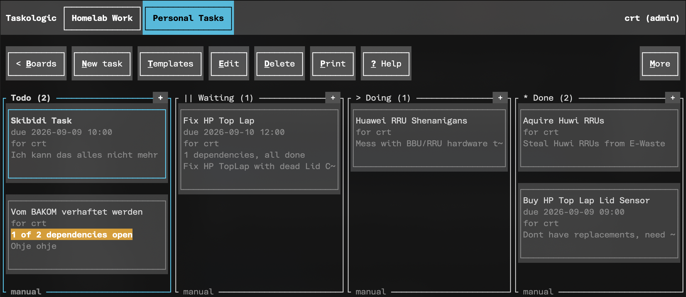

# Taskologic

A terminal Kanban board for people who like moving post-it's around, with bonus support for a receipt printer and a barcode scanner because i have severe autism.

Idea in the end is that you SSH or Telnet into your Taskologic Server where Taskologic is your actual shell giving you a TUI instead of a bin bash head wall.

## What the fuck does a receipt printer and a barcode scanner have to do with kanbanana???

Support for those were added because some people tend to hoard them (aka. me, hi!!!) realizing only after the fact that they actually have no real usecase for them... 

with this the goal of giving meaning to the endless hoarding is finally met and it allows for a bit more dopamine when completing tasks, eg like this :

Print the task, scan to start, scan to finish, be less depresso expresso.

## What you will need

- A linux host thats accessible via SSH or Telnet
- Rust 1.88 or newer
  - Note : Debian 13 ships 1.85 via apt, use rustup.rs
- Optionally :
  - Receipt Printer
  - Barcode Scanner

## How it is put together

With duct tape and good faith... jk but heres how it somewhat works together as a whole :

- `taskologicd` is the DEMON. It owns the one SQLite database, runs the scheduler for reminders and repeating tasks, and pushes live updates to everyone connected

- `taskologic` is the "client", and it is what gets set as your login shell. It draws the board, and it technically owns your printer

-> There is currently no alternative ways to log on other than via pam through a tty. Plans to change that are in mind but not a priority at all.

The printer and scanner config live with the user on purpose for that reason as to server wide.

## Da rules

- Boards can be 
  - public (all users on the system see it) 
  - private (only your user and board members see it)
  - locked (board cant be deleted by other board members other than admins and board owner)
- Admins can unlock locked boards and delete them but they cant (atleast through the UI, db wise ofc they could) see whats on that board.
- Deleting a task first tosses it into the archive. Nothing is really gone until the retention window runs out or you delete it manually.
- No feature is allowed to shell out to whatever a user typed since it literally uses pam via ssh/telnet for auth so yea kinda needed lol

## Da Boards and tasks

- Boards have columns, and three of them are special (like me): started, paused, and finished.
- Tasks have a title, an optional description, a checklist, a due date, dependencies on other tasks, and assigned members
- Tasks can repeat on a schedule, and they only regenerate once the previous one is actually finished (might make that an option in the future idk yet)
- Everything should be somewhat mouse and keyboard friendly, with a help overlay bound to `?`

## Built using

Rust, `ratatui`, `tokio`, `rusqlite` and a small pile of barcode crates duct taped together behind one internal interface. 

Client talks to DEMON using JSON Derulo over a Unix socket.

### Okay so what does each crate do?

- `taskologic-core` logic and brain
- `taskologic-proto` protocol
- `taskologicd` demon
- `taskologic` tui client
- `taskologic-print` barcode and receipt rendering

## Disclaimer :
I believe in that if LLM's were used for a project it should be clearly stated where and for what! For this project this means :

- All code comments have been fully sanetize using Large Language Models, I write literal garbage comments, very little if at all, curse in Swiss German through out all of my code and insult peoples mothers while writing it.
- Obviously bugs have had LLM's help along many times but the code was inspected and should mostly be decent. (except some of the printing related stuff that i was debugging at 3am)
- Tests were fully written by an LLM as I was way too lazy to write them myself for this small project, only inspected quicly

## Plans

- TTY Based Browser/Native client via normalish Web Ports
- non TTY PAM user backed authentication
- kiosk mode 
- time tracking reports with estimates on how long certain tasks (added as templates) should take
- calendar view
- Import / Export features

## Status

Eh i mean should be usable, perhaps take backups here and there of the db files.
